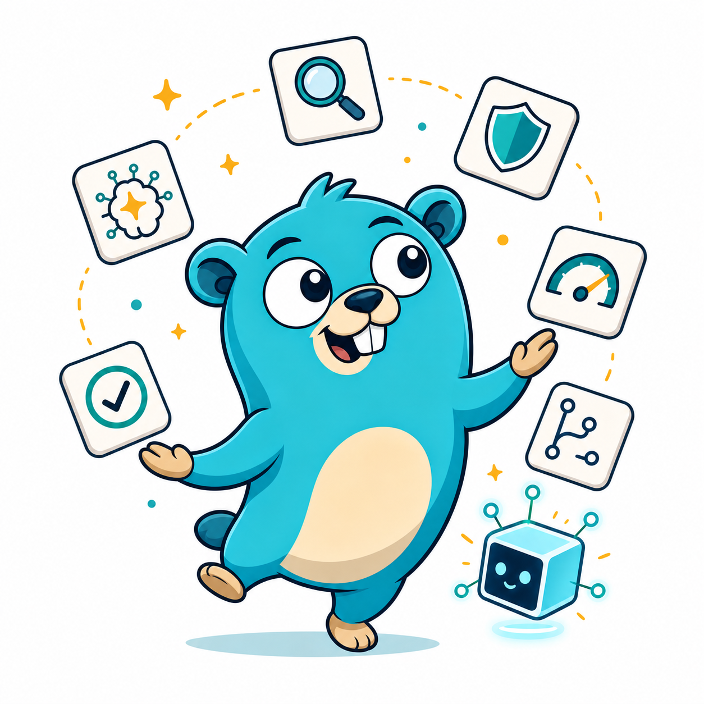

# Gopher Plugin

<p align="center">
  
</p>

Gopher packages evidence-driven Go engineering workflows as one installable
plugin for Codex, Claude Code, Grok Build, Kimi Code, OpenCode, and omp. Its
goal is to help an agent diagnose before it prescribes, choose idiomatic Go
designs, make small reversible changes, review code through explicit risk
lenses, and coordinate larger refactors with documented evidence.

The repository keeps one shared plugin implementation at `plugins/gopher/` and
exposes it through native marketplace manifests for each host. Codex reads the
`.agents/plugins/marketplace.json` catalog and the plugin's
`.codex-plugin/plugin.json` manifest. Claude Code reads
`.claude-plugin/marketplace.json` and the plugin's `.claude-plugin/plugin.json`
manifest. Grok Build reads `.grok-plugin/marketplace.json` and the plugin's
`.grok-plugin/plugin.json` manifest. Kimi Code reads
`.kimi-plugin/marketplace.json` and the plugin's `.kimi-plugin/plugin.json`
manifest. OpenCode installs the npm package `@alvadorncorp/gopher`, whose config
hook registers the same `skills/` tree and three native role agents. omp reads
`.omp-plugin/marketplace.json` and installs the same `plugins/gopher` tree; it
needs no plugin manifest of its own, resolving identity and version from
`.claude-plugin/plugin.json`. All six hosts load the same physical skill tree.

## What Gopher provides

Gopher is not a Go formatter, linter, or language server. It is a collection of
agent skills and references that guide engineering decisions and workflows for
Go repositories:

- Diagnose unexplained symptoms before choosing an owner or fix path, and check
  known readiness invariants before an action.
- Select Go-appropriate construction, value, error, and behavior patterns.
- Implement routine Go changes with local tests and proportional validation.
- Review diffs through exact lenses for correctness, tests, security,
  architecture, and concurrency/performance.
- Measure complexity and test quality, then separate safe local cleanup from
  broader design work.
- Modernize code against the project's declared Go version.
- Coordinate repository-wide refactors with baselines, sequencing, handoffs,
  and evidence.

The installable package intentionally ships no user-triggered hooks, MCP servers,
apps, LSP servers, or runtime visual assets. The OpenCode adapter uses only a
startup config hook to register the shared skills and native role agents.

## Package layout

- Codex marketplace: `.agents/plugins/marketplace.json`
- Claude Code marketplace: `.claude-plugin/marketplace.json`
- Grok Build marketplace: `.grok-plugin/marketplace.json`
- Kimi Code marketplace: `.kimi-plugin/marketplace.json`
- omp marketplace: `.omp-plugin/marketplace.json`
- Shared plugin: `plugins/gopher/`
- Codex manifest: `plugins/gopher/.codex-plugin/plugin.json`
- Claude Code manifest: `plugins/gopher/.claude-plugin/plugin.json`
- Grok Build manifest: `plugins/gopher/.grok-plugin/plugin.json`
- Kimi Code manifest: `plugins/gopher/.kimi-plugin/plugin.json`
- OpenCode package: `package.json`
- OpenCode adapter: `plugins/gopher/opencode/plugin.js`
- Shared skills: `plugins/gopher/skills/`
- Packaged agents (Claude Code, Grok Build): `plugins/gopher/agents/`
- Packaged agents (Codex): `plugins/gopher/agents/codex/`
- Packaged agents (OpenCode): `plugins/gopher/agents/opencode/`
- Packaged agents (omp): `plugins/gopher/omp/agents/`
- Structural and forward tests: `tests/`
- Architecture notes: `docs/`

## Skills and ownership

Each request has one primary owner. Skills exchange stable `gopher:<skill>` and
`pattern.*`/`go.*` identifiers through textual handoffs; no skill depends on a
relative path into a peer.

| Skill | Primary ownership |
|---|---|
| `design-patterns` | Language-agnostic code/module pattern diagnosis and selection; peers reverse-hand off open pattern forces |
| `application-architecture` | Language-agnostic internal application boundaries |
| `developer` | Config-aware, local and reversible Go implementation with adaptive test-first evidence; hands broad modernization and specialist work to their canonical owners |
| `architecture` | Go packages, modules/workspaces, dependency direction, seams, and public APIs |
| `concurrency` | Goroutine lifetime, channels, synchronization, context, races, deadlocks, leaks, and backpressure mechanics |
| `performance` | Asymptotic and algorithmic cost, allocations, GC, cache behavior, parsing, I/O amplification, benchmarks, profiles, latency, and throughput |
| `diagnose` | Evidence-driven attribution of unexplained Go symptoms |
| `security` | Go threat modeling, reachability, safe verification, remediation, debug and profiling endpoint exposure, and the ruling on what a telemetry attribute may carry |
| `review` | Read-only exact-mode review fan-out, consolidation, and verdict |
| `config` | The `.gopher-plugin.toml` project contract: bootstrap, validation, explanation, migration, and schema evolution |
| `complexity` | Cyclomatic/cognitive complexity, hotspots, reduction plans, and complexity CI policy |
| `test-quality` | Coverage, mutation, test effectiveness, and refactoring safety nets |
| `modernize` | Declared-version-aware Go language, API, module, dependency, and toolchain modernization |
| `refactor` | Repository-wide or multidimensional refactoring orchestration, sequencing, and evidence |
| `doctor` | Proactive readiness of the project, configuration, toolchain, module state, generated output, and a pending action against known invariants |
| `resilience` | Failure semantics, runtime safeguards, distributed degradation, recovery, and explicit reliability assessment |
| `observability` | Telemetry contracts and instrumentation for logs, metrics, traces, profile exposure, dashboards, alerts, correlation, cardinality, and redaction application |
| `codegen` | Lifecycle and trustworthiness of generated code: inventory, provenance, reproduction, staleness, and artifact verification |
| `cgo` | Go/C boundaries: ABI and representation, ownership and lifetime, pointer rules, callbacks and thread affinity, linking, and build matrices |
| `fuzz` | Native Go fuzz targets and invariants, seed corpora, bounded campaigns, crash triage, and regression promotion |

## Agents

Gopher ships three packaged role agents. Each one is a thin wrapper over a
canonical skill: the agent carries the binding and the constraint envelope, and
the skill keeps the workflow, the evidence discipline, and the output. The agents
add no ownership row and no orchestrator, so each one's primary owner stays the
skill it wraps.

| Agent | Skill | Markdown binding | Codex binding | OpenCode binding | omp binding | Declared edit envelope |
|---|---|---|---|---|---|---|
| `developer` | `gopher:developer` | `sonnet`, effort `medium` | sandbox `workspace-write` | `gopher-developer` subagent | `gopher-developer` | local and reversible, inside one package |
| `architect` | `gopher:architecture` | `opus`, effort `high` | sandbox `read-only` | `gopher-architect` subagent, `edit: deny` | `gopher-architect` | existing files only, under an explicit approval; never creates a file |
| `reviewer` | `gopher:review` | `opus`, effort `high` | sandbox `read-only` | `gopher-reviewer` primary agent, `edit: deny` | `gopher-reviewer` | none |

The markdown dialect binds the model, the reasoning effort, and the tool set. The
Codex agent dialect accepts `name`, `description`, `sandbox_mode`, and
`developer_instructions` and nothing else, so a Codex agent binds the sandbox
alone and its model and reasoning effort stay whatever the session carries.

The last column states what each agent is instructed to do, not what a host
prevents. All three agents retain `Bash`, and `Bash` can write, so outside the
Codex `read-only` sandbox these envelopes rest on the agent instructions rather
than on the host.

Claude Code and Grok Build load `plugins/gopher/agents/*.md`, and Codex loads
`plugins/gopher/agents/codex/*.toml`.
OpenCode loads the native agent definitions through the package config hook. All
three OpenCode roles inherit the session model and variant; `gopher-reviewer` is
a primary agent so it can dispatch read-only built-in `explore` children without
changing the global subagent-depth setting.
Kimi Code does not load packaged plugin agents, so the Kimi review and refactor
adapters restate the constraint envelope inline as instruction text with no
binding behind it at all: the review adapter dispatches through the runtime
`Agent` and `AgentSwarm` tools, and the refactor adapter through `Agent`.

omp loads native role agents from `plugins/gopher/omp/agents/` when that
directory is registered as an `extensions` root. The three names are
`gopher-architect`, `gopher-developer`, and `gopher-reviewer`, so they do not
shadow omp's bundled `reviewer`. Each wrapper binds tools, thinking level, and
an autoloaded skill; the session model stays whatever the host selected. The
omp review adapter still fans lenses out through bundled `scout` children, and
the refactor adapter dispatches the three Gopher roles. A marketplace install
alone does not register those agents at user scope; see Install locally in omp.

The definitions shipped in the package are the authoritative binding: the host
reads them when it loads the agent, so a project file cannot rebind the model,
the effort, or the tools an agent actually receives. The `[agents]` table of
`.gopher-plugin.toml` is the project's declared policy — disable the roster,
bound the reviewer's parallel window, tighten the authorization gate.
It may narrow an agent and it can never widen one.
Every agent reports a `policy_status` of `NOT_CONFIGURED`, `ALIGNED`,
`DIVERGED`, `UNVERIFIABLE`, or `BLOCKED_BY_POLICY`, so a declared value is never
presented as an applied one.

## Install locally in Codex

From this repository root, add the local marketplace and install the plugin:

```bash
codex plugin marketplace add .
codex plugin add gopher@alvadorncorp
```

Then start a new Codex CLI session or open a new Codex task in the desktop app
so the installed plugin snapshot is loaded.

For desktop installation through the plugin browser, add the marketplace with
the same `codex plugin marketplace add .` command, restart the ChatGPT desktop
app, open **Plugins** from Codex or Work mode, choose the `alvadorncorp`
marketplace, and install **Gopher**.

To confirm Codex can see the marketplace and plugin:

```bash
codex plugin marketplace list
codex plugin list
```

## Install locally in Claude Code

From this repository root, add the local marketplace and install the plugin:

```bash
claude plugin marketplace add . --scope user
claude plugin install gopher@alvadorncorp --scope user
```

Use `--scope project` instead of `--scope user` when the marketplace or
installation should be declared for the current project, or `--scope local` for
machine-local project state. Start a new Claude Code session after installation.

For development without installing from the marketplace, load the plugin only
for the current Claude Code session:

```bash
claude --plugin-dir ./plugins/gopher
```

To confirm Claude Code can see the plugin:

```bash
claude plugin marketplace list
claude plugin list
```

## Install locally in Grok Build

From this repository root, add the local marketplace and install the plugin:

```bash
grok plugin marketplace add .
grok plugin install gopher --trust
```

Then enable the plugin if it is listed as disabled (`grok plugin enable gopher`
or Space in the Plugins tab) and start a new Grok session, or press `r` in the
Plugins tab to reload.

For development without installing from the marketplace, load the plugin for a
single process with `--plugin-dir`:

```bash
grok agent --plugin-dir ./plugins/gopher --no-leader stdio
```

To confirm Grok can see the marketplace and plugin:

```bash
grok plugin marketplace list
grok plugin list
grok plugin validate plugins/gopher
```

## Install locally in Kimi Code

From this repository root, install the plugin from the local directory inside a
Kimi Code session:

```text
/plugins install ./plugins/gopher
```

Alternatively, browse the local marketplace catalog and install from it:

```text
/plugins marketplace ./.kimi-plugin/marketplace.json
```

Kimi Code installs plugins per user and copies the plugin to
`$KIMI_CODE_HOME/plugins/managed/gopher/`; editing this repository after
installation has no effect until you reinstall. Run `/reload` or start a new
session so the installed plugin snapshot is loaded.

To confirm Kimi Code can see the plugin:

```text
/plugins list
/plugins info gopher
```

## Install in OpenCode

Install the published package for the current project:

```bash
opencode plugin @alvadorncorp/gopher
```

For local development from this repository root, install the local package into
the current project instead:

```bash
opencode plugin "$(pwd)"
```

Add `--global` to either command to install it in the user configuration. Quit
and restart OpenCode after installation or an update because plugins and skills
are loaded at startup. Verify the installed package configuration with:

```bash
opencode debug config
```

Then start an OpenCode session and select `gopher-reviewer` when you need an
explicit read-only multi-lens review.

## Install locally in omp

From this repository root, add the local marketplace and install the plugin:

```bash
omp plugin marketplace add ./
omp plugin install gopher@alvadorncorp
```

Run `/reload-plugins` in a running session or start a new omp session after
installation so the plugin snapshot is loaded. To confirm omp can see the
plugin:

```bash
omp plugin marketplace list
omp plugin list
```

omp exposes the skills by their canonical names and applies no `gopher:`
namespace, and it resolves a skill by that bare name, so a same-named skill
from another installed plugin can win by provider precedence and shadow a
Gopher skill. A user-scoped marketplace install also does not expose the
packaged agents until a directed root is registered. Pin both the agent root
and the skill tree in `~/.omp/agent/config.yml`:

```yaml
extensions:
  - ~/.omp/plugins/node_modules/gopher/omp
skills:
  customDirectories:
    - ~/.omp/plugins/node_modules/gopher/skills
```

`extensions` points at the directory above `agents/`, not at `agents/` itself
and not at the shared plugin root. Restart the session after changing this
file; a previously memoized agent list does not prove the new state. A
project-scoped install uses the matching paths under
`<project>/.omp/plugins/node_modules/gopher`.

Uninstalling or disabling the marketplace plugin does not remove an
`extensions` entry. To stop the Gopher roles, delete that directed entry or
list `gopher-architect`, `gopher-developer`, and `gopher-reviewer` in
`task.disabledAgents`.

If `~/.omp/plugins/node_modules/gopher` is absent, use the `installPath` from
`~/.omp/plugins/installed_plugins.json` and update it when the installed
version changes.

## Use Gopher
After installation, ask naturally for Go engineering help or select a bundled
skill explicitly. Codex can route from the prompt or from an installed plugin
skill. Claude Code and Grok Build expose plugin skills as namespaced commands
such as `/gopher:review --mode full`. Kimi Code routes from the prompt or from
explicit skill invocation such as `/skill:review`. OpenCode exposes the skills
by their canonical names, such as `review`; it does not apply a `gopher:`
namespace, so users must avoid duplicate skill names in their OpenCode setup.
omp also exposes the skills by their canonical names with no namespace, and
resolves each by that bare name, so a competing plugin can shadow one; see the
Install locally in omp section for the remedy.

Examples:

- `Diagnose this Go problem before proposing a fix.`
- `Choose an idiomatic pattern for this Go design.`
- `Review this Go change with --mode tests,security.`
- `Coordinate a repository-wide refactor that reduces complexity and modernizes APIs together.`

Review lenses are `correctness`, `tests`, `security`, `architecture`,
`concurrency`, `performance`, and `complexity`. `--mode full` selects all seven.
A comma-separated mode selects exactly that subset. Without a mode, `review`
recommends lenses and waits for confirmation before dispatch.

## Project configuration

The optional `.gopher-plugin.toml` project contract lets repositories declare
module roots, package patterns, complexity thresholds, test-quality targets,
modernization policy, refactor safeguards, and tool selection. The default
template lives at:

```text
plugins/gopher/skills/config/templates/default.gopher-plugin.toml
```

Use the `config` skill to bootstrap, validate, or explain the effective project
configuration. The current schema version `5` includes the `[developer]` policy
table and the `[workflow]` session policy table:

```toml
[developer]
idiom_policy = "latest-compatible"
test_workflow = "adaptive-tdd"

[workflow]
planning_preflight = ["architecture:triage"]
planning_require_structure_decision = false
implementation_owner = "developer"
post_implementation_review = "off"
post_implementation_lenses = "heuristic"
max_auto_review_files = 20
```

`idiom_policy` accepts `latest-compatible`, `project-aligned`, or
`explicit-only`; `test_workflow` accepts `adaptive-tdd`, `strict-tdd`, or
`test-after`. The defaults are `latest-compatible` and `adaptive-tdd`.
Each developer key resolves independently in this order: an explicit
current-session instruction, `.gopher-plugin.toml`, adopted project
configuration and commands, then the Gopher default.

The `[workflow]` keys are session policy hints only. They do not install hooks,
do not mutate the tree, and cannot widen packaged agent bindings.
`post_implementation_review` accepts `off`, `recommend`, or `auto` (default
`off`). Planning modes include `architecture` triage and `refactor` plan;
development modes include `review` auto/delta after local implementation when
the host session honors the policy.

Schema versions `1`, `2`, `3`, and `4` keep working as `MIGRATION_AVAILABLE`.
Before migration, missing `[developer]` and `[workflow]` values use the
defaults without writing them to the project. Only a confirmed
`config --bootstrap` migration persists the schema version `5` additions; it
preserves existing values. The developer workflow uses these policies for local
implementation and its focused test evidence. It does not perform broad
modernization or rewrite unrelated code; those remain with the appropriate
specialist skill.

## Development and validation

Run deterministic gates:

```bash
python3 tests/validate_repo.py
python3 -m unittest discover -s tests -p 'test_*.py'
python3 "${CODEX_HOME:-$HOME/.codex}/skills/.system/plugin-creator/scripts/validate_plugin.py" plugins/gopher
claude plugin validate . --strict
grok plugin validate plugins/gopher
node --check plugins/gopher/opencode/plugin.js
python3 tests/run_forward_tests.py --validate-only
```

Live forward tests require authenticated local harnesses and installed Codex,
Claude Code, Grok Build, Kimi Code, OpenCode, and/or omp plugin snapshots:

```bash
python3 tests/run_forward_tests.py --harness codex --harness claude --harness grok --harness kimi --harness opencode --harness omp
```

Review official, version-sensitive Go references after every stable Go release
and at least quarterly. All repository documentation is written in English.

## License

MIT - see [LICENSE](LICENSE).
